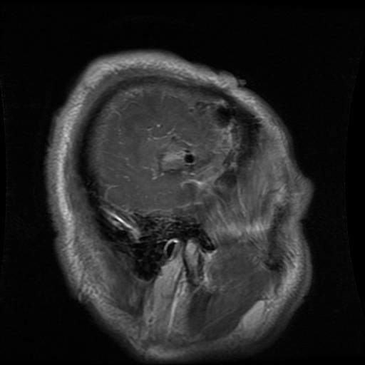
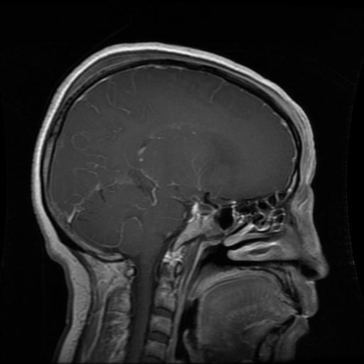
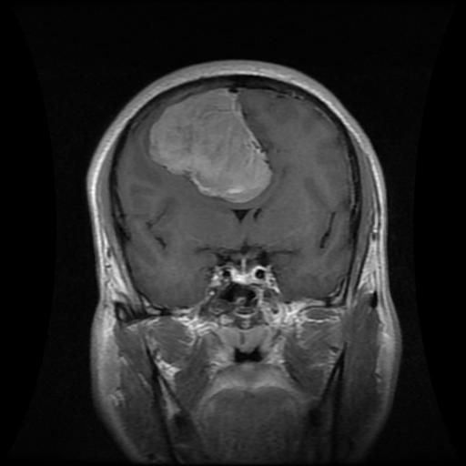
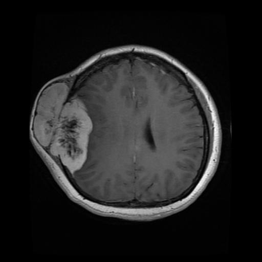
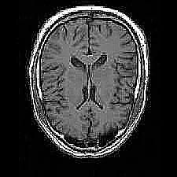
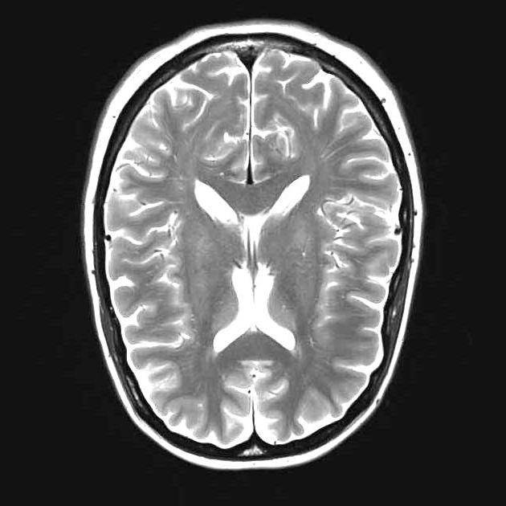
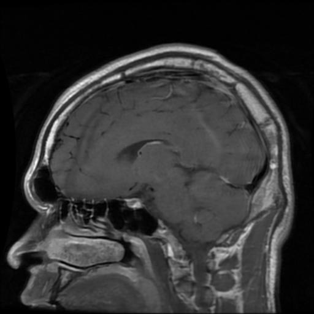
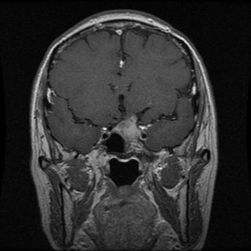

# Brain Tumor Classification — `brain_img.py`

A CNN-based brain tumor classification model trained on MRI images. Classifies scans into 4 categories using TensorFlow/Keras with data augmentation and class-weight balancing.

---

## Dataset

```
brain_tumor_dataset/
├── glioma/
├── meningioma/
├── healthy/
└── pituitary/
```

Images are resized to **150×150 px**, split 80/20 for training/validation.

---

## Sample Images

### Glioma
> Malignant tumor originating from glial cells. Typically shows irregular, infiltrative mass with surrounding edema.

| Sample 1 | Sample 2 |
|----------|----------|
|  |  |

---

### Meningioma
> Tumor arising from the meninges (protective brain lining). Usually appears as a well-defined, extra-axial mass.

| Sample 1 | Sample 2 |
|----------|----------|
|  |  |

---

### Healthy
> No tumor present. Normal brain tissue structure with no abnormal mass or lesion.

| Sample 1 | Sample 2 |
|----------|----------|
|  |  |

---

### Pituitary
> Tumor located in the pituitary gland at the base of the brain. Appears as a midline sellar/suprasellar mass.

| Sample 1 | Sample 2 |
|----------|----------|
|  |  |

---

## Model Architecture

A custom Sequential CNN:

```
Input (150×150×3)
  → Conv2D(32) + MaxPool
  → Conv2D(64) + MaxPool
  → Conv2D(128) + MaxPool
  → Conv2D(256) + MaxPool
  → Flatten
  → Dense(512) + Dropout(0.3)
  → Dense(4, softmax)
```

**Optimizer:** Adam (lr=0.001)  
**Loss:** Categorical Crossentropy  
**Class imbalance:** Handled via `compute_class_weight`

---

## Data Augmentation

Applied only to training set:

| Parameter | Value |
|-----------|-------|
| Rotation range | 20° |
| Width / Height shift | 0.15 |
| Shear range | 0.15 |
| Zoom range | 0.15 |
| Horizontal flip | True |
| Fill mode | nearest |

---

## Callbacks

| Callback | Monitors | Config |
|----------|----------|--------|
| EarlyStopping | val_accuracy | patience=10, restore best weights |
| ModelCheckpoint | val_accuracy | saves `best_brain_tumor_model.h5` |
| ReduceLROnPlateau | val_loss | factor=0.5, patience=3, min_lr=1e-7 |

---

## Training

```python
history = model.fit(
    train_generator,
    epochs=50,
    validation_data=validation_generator,
    class_weight=class_weights_dict,
    callbacks=[early_stopping, model_checkpoint, reduce_lr]
)
```

---

## Results

| Metric | Score |
|--------|-------|
| Validation Loss | **0.0706** |
| Validation Accuracy | **97.86%** |

---

## Requirements

```
tensorflow
numpy
pandas
matplotlib
seaborn
scikit-learn
```

---

## Usage

```bash
# Place dataset in project root as brain_tumor_dataset/
python "Python Files/brain_img.py"
```
