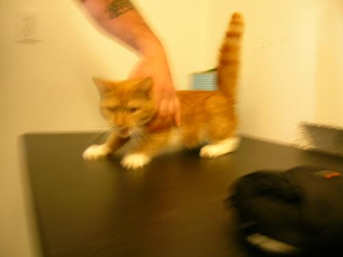
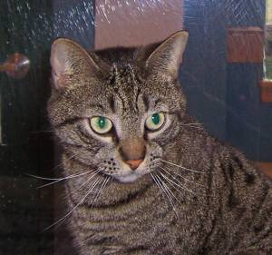
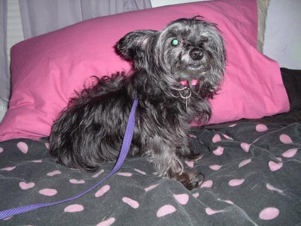
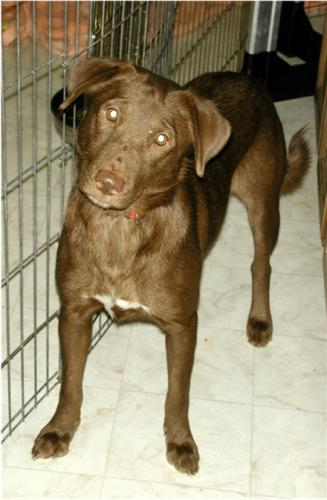

# Cat vs. Dog Image Classification

## 📌 Project Overview
This project focuses on classifying images of cats and dogs using deep learning and Convolutional Neural Networks (CNNs). To achieve high accuracy and compare different computer vision techniques, this repository implements both a custom-built CNN trained from scratch and a Transfer Learning approach utilizing the pre-trained **MobileNet** architecture.

## 📂 Dataset & Sample Images
The models were trained and tested on a comprehensive dataset of cat and dog images. The data underwent rigorous preprocessing to ensure the models could generalize well across different angles, lighting conditions, and backgrounds.

*Here are examples of the images the model classifies:*

### 🐱 Cat Example



### 🐶 Dog Example



## 🛠️ Project Structure & Files

* `clean2.py`: The data preprocessing script. It handles cleaning, resizing, normalizing, and preparing the raw image dataset for neural network ingestion.
* `main.py`: The core script where the model architectures are defined, trained, and evaluated.
* `best_model.h5`: The saved weights of the custom-built CNN model, which achieved the highest accuracy during training from scratch.
* `best_model_mobilnet.h5`: The saved weights of the fine-tuned MobileNet model, leveraging transfer learning for robust feature extraction and faster convergence.
* `requirements.txt`: A list of all the Python dependencies required to run the project locally.

## 🤖 Models & Approach

1.  **Custom CNN (`best_model.h5`):** A deep learning architecture designed from the ground up, featuring a sequence of Convolutional, MaxPooling, and Dropout layers to independently extract features and prevent overfitting.
2.  **MobileNet Transfer Learning (`best_model_mobilnet.h5`):** To boost performance and accuracy, we integrated the MobileNet architecture (pre-trained on ImageNet). By fine-tuning the top layers, the model leverages learned representations of basic shapes and textures, applying them specifically to the cat/dog classification task.

## 💻 How to Run the Project

Follow these steps to set up and run the project on your local machine:

**1. Clone the repository:**
```bash
git clone [https://github.com/yourusername/cat-dog-classification.git](https://github.com/yourusername/cat-dog-classification.git)
cd cat-dog-classification
```

**2. Install dependencies:**
Install the required libraries using the requirements.txt file:
```bash
pip install -r requirements.txt
```

**3. Data Preprocessing (Optional):**
If you want to prepare your own dataset, run the cleaning script first:
```bash
python clean2.py
```

**4. Train or Evaluate the Model:**
Execute the main pipeline to start the training or evaluation process:
```bash
python main.py
```

**Note:** You can load the pre-trained best_model.h5 or best_model_mobilnet.h5 weights directly using Keras/TensorFlow to make predictions on new, unseen images without retraining.

🚀 Technologies Used
Programming Language: Python
Deep Learning Frameworks: TensorFlow, Keras
Computer Vision & Data Processing: NumPy, Pandas, Matplotlib, OpenCV / PIL

📜 License
This project is open-source and available under the MIT License.
